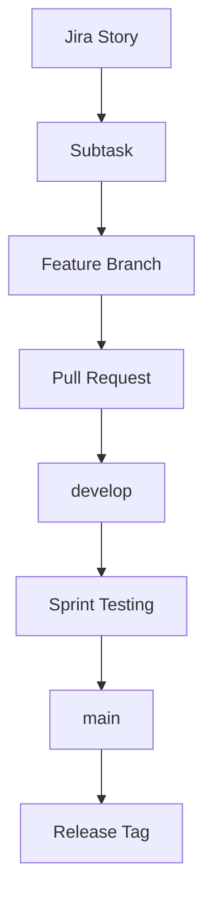

# Campus Printing System

Campus Printing System for university students — submit print jobs, manage documents, and complete campus payments through a shared web application.

## Project Overview

| Item | Detail |
|------|--------|
| Team size | 2 developers |
| Methodology | Scrum |
| Sprints | 3 |
| Stories per sprint | 4 |
| Branching model | Git Flow–style (`main` + `develop` + feature branches) |

**Story 1 (completed):** Login UI, Register UI, Login API, Register API.

Future stories are delivered as Jira subtasks on feature branches merged into `develop`, then released to `main` at sprint end.

## Repository Structure

```text
/
├── frontend/          # Student-facing HTML/CSS (and future UI)
├── backend/           # Express API
├── docs/              # SRS, diagrams, API docs, Git workflow
├── .github/           # PR and issue templates
├── README.md
└── LICENSE
```

## Tech Stack

- **Frontend:** HTML, CSS (Story 1 pages under `frontend/`)
- **Backend:** Node.js, Express
- **Auth helpers:** bcryptjs, cors
- **Process:** Scrum + Jira + GitHub Pull Requests

## Setup

```bash
npm install
npm start
```

API: `http://localhost:3000`

Frontend (Story 1): open `frontend/index.html` and `frontend/register.html` in a browser (or serve the `frontend/` folder locally).

### Useful scripts

| Script | Command |
|--------|---------|
| Start API | `npm start` |
| Watch API | `npm run dev` |
| Lint commit message | `npx commitlint --edit` |

## Branching Strategy

| Branch | Role |
|--------|------|
| `main` | Stable releases only. Never develop here. |
| `develop` | Sprint integration branch. All features merge here first. |
| `feature/<story>-<subtask>` | One Jira subtask per branch. |

Examples: `feature/auth-register-ui`, `feature/login-api`, `feature/dashboard-ui`.

Full guide: [docs/GIT_WORKFLOW.md](docs/GIT_WORKFLOW.md)

## Git Workflow

```text
feature/*  →  PR  →  develop  →  (sprint end) PR  →  main  →  tag (v0.1.0 / v0.2.0 / v1.0.0)
```

- Feature branches start from `develop`.
- Feature branches merge **only** into `develop` via Pull Requests.
- Delete feature branches after merge.
- Never merge feature branches directly into `main`.

## How to Create Feature Branches

```bash
git checkout develop
git pull origin develop
git checkout -b feature/<story>-<subtask>
```

## Pull Request Process

1. Push your feature branch: `git push -u origin feature/<name>`
2. Open a PR with **base = `develop`**
3. Complete the PR template (Summary, Jira Story, Subtasks, Testing, Checklist)
4. Get review from the other developer
5. Merge into `develop`
6. Delete the feature branch

## Release Process

At the end of each sprint:

1. Test everything on `develop`
2. Open a PR: `develop` → `main`
3. Merge the release PR
4. Tag on `main`: `v0.1.0`, `v0.2.0`, then `v1.0.0`

```bash
git checkout main
git pull origin main
git tag -a v0.1.0 -m "Release v0.1.0"
git push origin v0.1.0
```

## Sprint Workflow Diagram



## Conventional Commits

```text
feat(auth): implement login API
feat(upload): add document upload
fix(order): resolve duplicate order bug
refactor(database): optimize queries
docs(readme): update setup guide
test(login): add authentication tests
```

## Documentation

| Document | Path |
|----------|------|
| Git workflow & commands | [docs/GIT_WORKFLOW.md](docs/GIT_WORKFLOW.md) |
| SRS | [docs/SRS.md](docs/SRS.md) |
| ER Diagram | [docs/ER_DIAGRAM.md](docs/ER_DIAGRAM.md) |
| UML | [docs/UML.md](docs/UML.md) |
| API Documentation | [docs/API_DOCUMENTATION.md](docs/API_DOCUMENTATION.md) |

## Backend API (Story 1)

### Login — `POST /api/auth/login`

```json
{
  "email": "student@university.edu",
  "password": "yourpassword"
}
```

### Register — `POST /api/auth/register`

```json
{
  "firstName": "John",
  "lastName": "Doe",
  "email": "student@university.edu",
  "password": "yourpassword",
  "gender": "male"
}
```

More detail: [docs/API_DOCUMENTATION.md](docs/API_DOCUMENTATION.md)

### Dashboard API

**Endpoint:** `GET /api/dashboard?email=student@university.edu`

Returns student profile, print quota, wallet, and recent activity.

### File Upload API

**Endpoint:** `POST /api/uploads`

Multipart fields: `file`, `email`. Allowed: `.pdf`, `.docx`, `.pptx` (max 25 MB).

```bash
npm test
```

### Documents API

**List:** `GET /api/documents?email=student@university.edu`  
**Get one:** `GET /api/documents/:id`

```bash
npm run test:documents
```

## License

ISC — see [LICENSE](LICENSE).

