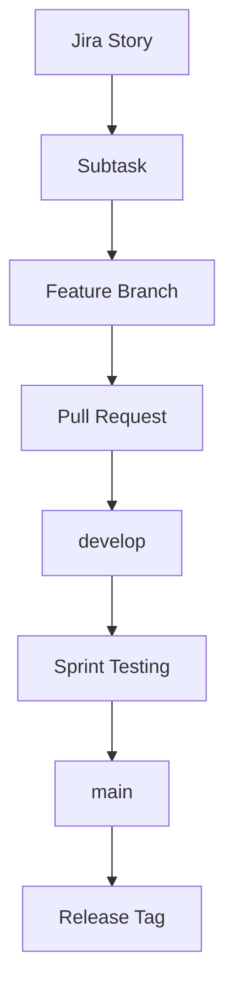

# Git Workflow — Campus Printing System

This document is the single source of truth for branching, commits, pull requests, and sprint releases.

**Rules**

- Never develop directly on `main`.
- Never merge feature branches directly into `main`.
- Do not rewrite Git history, force push, or delete Story 1 branches/commits.
- One Jira subtask = one feature branch = one pull request into `develop`.

---

## Permanent branches

| Branch | Purpose |
|--------|---------|
| `main` | Stable releases only. Tagged after each sprint. |
| `develop` | Integration branch for all in-progress sprint work. |

Story 1 was completed before this workflow and remains on `main` as-is. All **future** work starts from `develop`.

---

## Feature branch naming

Format:

```text
feature/<story>-<subtask>
```

Examples:

```text
feature/auth-register-ui
feature/auth-register-api
feature/login-ui
feature/login-api
feature/dashboard-ui
feature/upload-document-api
feature/payment-backend
```

---

## Conventional Commits

Commit messages must follow:

```text
<type>(<scope>): <description>
```

Common types: `feat`, `fix`, `docs`, `style`, `refactor`, `perf`, `test`, `build`, `ci`, `chore`, `revert`.

Examples:

```text
feat(auth): implement login API
feat(upload): add document upload
fix(order): resolve duplicate order bug
refactor(database): optimize queries
docs(readme): update setup guide
test(login): add authentication tests
```

A `commit-msg` Git hook (Commitlint + Husky) validates messages locally.

---

## Create a feature branch

```bash
git checkout develop
git pull origin develop
git checkout -b feature/<story>-<subtask>
```

Example:

```bash
git checkout develop
git pull origin develop
git checkout -b feature/dashboard-ui
```

---

## Commit work

```bash
git add .
git commit -m "feat(dashboard): add student dashboard layout"
```

---

## Push the feature branch

```bash
git push -u origin feature/<story>-<subtask>
```

Example:

```bash
git push -u origin feature/dashboard-ui
```

---

## Open a Pull Request (feature → develop)

1. Open GitHub → **Compare & pull request**.
2. Set **base** branch to `develop`.
3. Set **compare** branch to your `feature/...` branch.
4. Fill in `.github/PULL_REQUEST_TEMPLATE.md` (Summary, Jira Story, Subtasks, Testing, Checklist).
5. Request review from the other developer.
6. Merge only after approval (prefer **Squash and merge** or **Merge commit**; agree as a team and stay consistent).
7. Delete the feature branch after merge (GitHub checkbox or commands below).

Never open feature PRs against `main`.

---

## Delete a feature branch after merge

Remote:

```bash
git push origin --delete feature/<story>-<subtask>
```

Local:

```bash
git checkout develop
git pull origin develop
git branch -d feature/<story>-<subtask>
```

---

## Sprint release (develop → main)

At the end of each sprint, after testing on `develop`:

### 1. Update local branches

```bash
git checkout develop
git pull origin develop
git checkout main
git pull origin main
```

### 2. Open a release Pull Request

On GitHub:

- **base:** `main`
- **compare:** `develop`
- Title example: `Release: Sprint 2 — v0.2.0`

### 3. Merge the release PR into `main`

### 4. Tag the release on `main`

```bash
git checkout main
git pull origin main
git tag -a v0.1.0 -m "Release v0.1.0 — Sprint 1 baseline"
git push origin v0.1.0
```

Version plan:

| Sprint | Suggested tag |
|--------|----------------|
| Sprint 1 baseline (Story 1 + workflow) | `v0.1.0` |
| Sprint 2 | `v0.2.0` |
| Sprint 3 / production-ready | `v1.0.0` |

### 5. Sync `develop` after release (if needed)

If hotfixes landed on `main`, merge `main` back into `develop`:

```bash
git checkout develop
git pull origin develop
git merge main
git push origin develop
```

---

## Daily developer workflow

1. Pull latest `develop`.
2. Create `feature/<story>-<subtask>` from `develop`.
3. Implement the assigned Jira subtask only.
4. Commit with Conventional Commits.
5. Push the feature branch.
6. Open a PR into `develop`.
7. Address review comments.
8. Merge into `develop`.
9. Delete the feature branch.
10. Repeat for the next subtask.

---

## Sprint workflow diagram



---

## Recommended GitHub settings

Configure in the repository settings (manual, one-time):

1. Default branch: `main` (releases) or keep `main` and always develop on `develop`.
2. Branch protection for `main`:
   - Require pull request before merging
   - Require at least 1 approval
   - Do not allow force pushes
3. Branch protection for `develop`:
   - Require pull request before merging
   - Require at least 1 approval
4. Prefer deleting head branches after PRs are merged.

---

## What not to do

- Do not commit directly to `main` or `develop` for feature work.
- Do not merge `feature/*` into `main`.
- Do not use `git push --force` on shared branches.
- Do not rewrite or delete Story 1 history or existing SCRUM branches.
- Do not put multiple unrelated subtasks in one feature branch.
